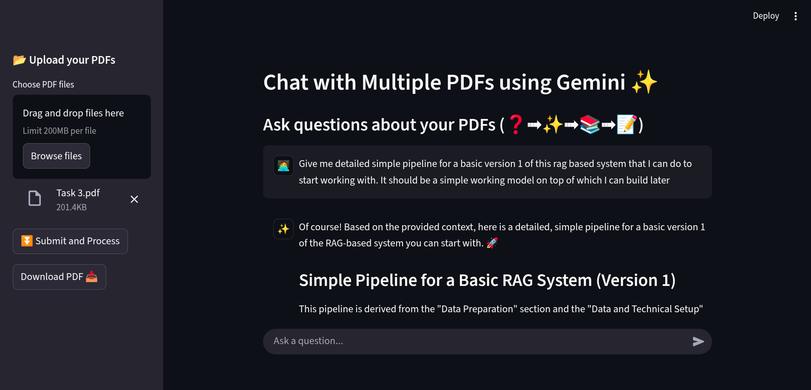
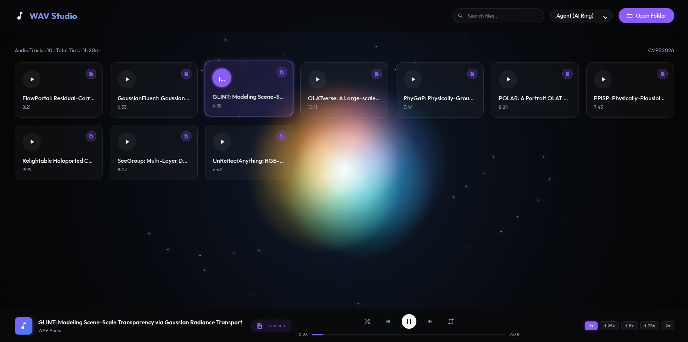

# 🚀 Projects

Collections of some of my small projects...

---

## 🤖 1. Gemini Chatbot (`Gemini_Chatbot/`)

A **Retrieval-Augmented Generation (RAG)** application that leverages Google's `gemini-2.5-pro` large language model. This chatbot allows users to upload custom documents and ask questions directly related to their content, acting as a smart document assistant.

### ✨ Key Features
- **Context-Aware Answers:** Generates responses based strictly on the uploaded text, minimizing AI hallucinations.
- **Automated Text Pipeline:** Automatically handles document parsing, text chunking, and vector embedding generation using FAISS.
- **Interactive UI:** Features a clean, chat-based interface built with Streamlit.
- **Tech Stack:** Python, Streamlit, FAISS (Vector Store), Google Gemini API.

### How to run:

Navigate to the directory and run:

```bash
streamlit run app.py
```

> Built this as a DC in AI Club [↗️](https://github.com/AI-Club-IIT-Madras/RAG_LLMs)

<div align="center">
  
</div>

---

## 🌐 2. 3D Reciprocal Lattice Visualizer (`Reciprocal_Lattice_Visualiser/`)

An interactive 3D web application designed to help students and enthusiasts explore fundamental concepts of solid-state physics. It provides intuitive visualizations of crystal lattices in both **real space** and **reciprocal space**.

### ✨ Key Features
- **Multiple Lattice Types:** Supports visualizing Simple Cubic (SC), Body-Centered Cubic (BCC), and Face-Centered Cubic (FCC) structures.
- **Interactive 3D Exploration:** Fully rotatable, pannable, and zoomable 360° views of the crystal models.
- **Real-Time Parameter Control:** Instantly adjust lattice constants ($a$) and the number of unit cells ($N$) to observe structural changes.
- **Advanced Structural Visuals:** Independently toggle the visibility of Real-space lattices, Reciprocal-space lattices, Wigner-Seitz cells, and the First Brillouin zones.
- **Tech Stack:** Python, Streamlit, 3D Plotting Libraries.

### How to run:

Navigate to the directory and run:

```bash
streamlit run app.py
```

> Built this while studying for the Materials Science for Electrical Engineering (EE2021) course.

---

## 🎵 3. Audio Explorer Pro / WAV Studio (`WAVStudio.html`)

A highly polished, production-ready web application designed for immersive audio playback and exploration. This standalone application is built with a focus on premium UI/UX design and modern web aesthetics.

> Basically I made this when I just wanted to listen to Research papers instead of reading them... and didn't like the UI of VLC media player...

1. First I created a short summary of the paper and also extracted the Abstract and Intro from the Research paper using Gemini.
2. Then I used [Fame Speak](https://www.famespeak.online/studio) to convert the text to speech.
3. Then I put the text into `paper_name.md` and downloaded the audio file as `paper_name.wav`.

<div align="center">
  
</div>
